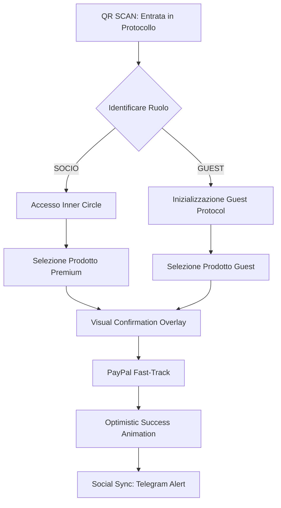

# UX Design Specification bronx

**Author:** Max Allegri
**Date:** 2026-01-31

---

## 1. Executive Summary

### Project Vision
Creare un'esperienza "Social Ledger" per il Box, dove la precisione gestionale incontra un'atmosfera irriverente e informale.

### Target Users
*   **Soci:** Utenti ricorrenti che cercano velocità (One-Click) e appartenenza.
*   **Guest:** Utenti occasionali che cercano immediatezza (No-Registration).
*   **Admin:** Operatori che cercano efficienza tramite automazione AI.

### Key Design Challenges
*   Bilanciamento tra estetica giocosa e performance di checkout.
*   Gestione degli stati offline/caricamento per ambienti con scarsa connettività.

### Design Opportunities
*   Gamification dei consumi (Wall of Fame/Shame).
*   Interfaccia di input innovativa via NLP (AI Butler).

## 2. Core User Experience

### Defining Experience
L'azione centrale è il "Momento della Sete": un flusso ultra-rapido che va dalla scansione del QR code alla conferma del pagamento. L'obiettivo è minimizzare l'attrito tra il desiderio del prodotto e il possesso fisico.

### Platform Strategy
*   **PWA (Progressive Web App):** Installabile sulla Home senza passare dagli store.
*   **Mobile-First & Touch-Centric:** Layout ottimizzato per l'uso con una sola mano.
*   **Offline Availability:** Catalogo e stati dell'app accessibili anche in ambienti con scarsa connettività (cantine).

### Effortless Interactions
*   **Smart Location:** Riconoscimento automatico del frigo scansionato.
*   **One-Click Buy:** Flusso di acquisto immediato per i Soci autenticati.
*   **Guest Zero-Friction:** Accesso diretto via QR senza registrazione obbligatoria.

### Critical Success Moments
*   **The Social Sync:** La notifica istantanea su Telegram dopo l'acquisto, che chiude il loop tra azione digitale e riconoscimento sociale.
*   **Guest "Aha!" Moment:** La sorpresa di poter pagare in meno di un minuto senza scaricare nulla.

### Experience Principles
1.  **Speed over Everything:** Riduzione maniacale dei passaggi e delle schermate.
2.  **Irreverence by Design:** Linguaggio e visual divertenti, fedeli all'atmosfera del box.
3.  **Visual Confirmation:** Animazioni distintive (neve, icone) per confermare il successo dell'operazione.
4.  **Inclusività del Box:** Nessuna barriera tecnica per gli ospiti occasionali.

## 3. Desired Emotional Response

### Primary Emotional Goals
*   **Complicità e Appartenenza:** L'utente deve sentirsi "a casa", parte di un gruppo esclusivo ma informale.
*   **Divertimento (Delight):** Sorpresa positiva attraverso micro-interazioni ironiche e inaspettate.
*   **Sicurezza Rilassata:** Una sensazione di totale fiducia nelle transazioni (PayPal), nonostante il tono irriverente dell'interfaccia.

### Emotional Journey Mapping
*   **Ingresso (QR Scan):** Curiosità e intrigo ("Che succede qui?").
*   **Selezione & Acquisto:** Adrenalina e focus (velocità d'azione).
*   **Conferma (Notifica Social):** Soddisfazione e connessione sociale ("Il gruppo vede e reagisce").
*   **Rientro:** Familiarità e piacere del "rituale".

### Micro-Emotions
*   **Soddisfazione Istantanea:** Il feedback visivo e social post-acquisto.
*   **Senso di Identità:** Essere riconosciuti dal sistema (Socio) o accolti calorosamente (Guest).

### Design Implications
*   **Dualità di Linguaggio:** Uso di componenti UI solidi e professionali per le transazioni, affiancati da copy e animazioni "rough" per il resto dell'esperienza.
*   **Gestione Errori:** In caso di errore (es. pagamento fallito), il sistema deve passare prontamente a un tono chiaro, utile e rassicurante, abbandonando temporaneamente l'ironia.

### Emotional Design Principles
1.  **Celebrate the Action:** Ogni acquisto è un evento positivo celebrato visivamente.
2.  **Transparent Fun:** Il divertimento non deve mai oscurare la chiarezza dei costi o dello stato dell'ordine.
3.  **Human AI Interaction:** L'AI non deve sembrare un bot, ma un membro del box (sarcastico ma leale).

## 4. UX Pattern Analysis & Inspiration

### Inspiring Products Analysis
*   **Fintech Apps (Revolut/Satispay):** Benchmark per la velocità del checkout e il login biometrico/persistente.
*   **Finanza/Betting Platforms:** Ispirazione per layout densi, tabelle di "quotazione" (stock) e sensazione di urgenza/adrenalina.
*   **Communication Hubs (Telegram/Discord):** Riferimento per micro-interazioni, bot e notifiche push che sembrano naturali e immediate.

### Transferable UX Patterns
*   **Optimistic UI:** Feedback istantaneo di successo mentre il server elabora (critico per la Gen Z).
*   **Haptic Feedback:** Vibrazioni tattili per simulare la pressione di tasti fisici su mobile.
*   **Skeleton Screens:** Transizioni fluide per nascondere la latenza di rete nel caricamento del catalogo.

### Anti-Patterns to Avoid
*   **Politeness Excess:** Popup gentili o eccessivi "Sei sicuro?". Il target preferisce un tono diretto e cinico.
*   **Over-Rounding:** Bordi troppo arrotondati o stili "gommosi" che contrastano con l'anima brutale del box.
*   **Multi-step Checkout:** Ogni secondo extra è un ostacolo al "Momento della Sete".

### Design Inspiration Strategy (Multi-Directional Experimentation)
Data la natura del gruppo (maschi, ludopatici, black humor), esploreremo tre direzioni di design attraverso esperimenti futuri:
1.  **Direction A: "The Underworld" (Bisca Clandestina):** Estetica dark-noir, grid-based, colori neon su nero.
2.  **Direction B: "Trading Floor" (Scommesse Sportive):** Layout denso, tabelle di "andamento stock" e visualizzazione "Live".
3.  **Direction C: "The Terminal" (Hack-Log):** Minimalismo estremo, caratteri monospazio, estetica "codice/terminale".

## 5. Design System Foundation

### Design System Choice
**Tailwind CSS + Headless UI**

### Rationale for Selection
*   **Flessibilità Multi-Mood:** Tailwind permette di implementare le tre direzioni di design (Bisca, Betting, Terminal) agendo semplicemente sulla configurazione dei token e delle utility class, senza dover sovrascrivere stili predefiniti pesanti.
*   **Performance PWA:** Garanzia di bundle CSS minimi, essenziale per rispettare il requisito non funzionale di caricamento interattivo in meno di 2 secondi su reti 4G.
*   **Rapidità di Prototipazione:** Facilità nel creare "Style Spike" e varianti grafiche grazie all'approccio utility-first.

### Implementation Approach
Utilizzeremo un approccio **"Atomic CSS"** customizzato. Definiremo un file di configurazione Tailwind che espone variabili CSS (Design Tokens) per colori, spaziatura e tipografia, permettendo lo scambio di "pelle" dell'interfaccia in modo dinamico o tramite build flag.

### Customization Strategy
*   **Tokens:** Colori neon vibranti, neri profondi (Nero Antracite), e scale tipografiche basate su font Monospazio e Sans-serif brutali (es. Inter, JetBrains Mono).
*   **Layout:** Griglie rigide di 1px, zero ombreggiature (box-shadow) e spigoli vivi (border-radius: 0) per supportare l'estetica "Rough".
*   **Feedback:** Utilizzo di animazioni CSS atomiche per supportare il concetto di "Optimistic UI".

## 6. Defining Core Experience: "Scan to Drink"

### Una Definizione Chiara
Il cuore di bronx è l'interazione "Scan to Drink": un loop ultra-veloce che trasforma la scansione di un QR code nell'acquisto immediato di un prodotto fisico. L'app non è uno store da navigare, ma un telecomando per il frigo del box.

### User Mental Model
L'app è percepita come l'estensione digitale del magazzino fisico. L'utente opera in modalità "fast-brain" (sete, bisogno immediato), non in modalità "browsing". Ogni secondo di attesa o ogni click superfluo rompe il ritmo della socializzazione nel box.

### Success Criteria
*   **Zero Loading Perceived:** Uso sistematico di Skeleton Screens e Optimistic UI per gestire la latenza di rete.
*   **One-Tap Purchase:** Per gli utenti autenticati, l'azione di acquisto deve essere ridotta al minimo numero di interazioni possibili dopo il caricamento del catalogo.
*   **Social Confirmation:** Il feedback di successo deve essere simultaneo tra l'interfaccia utente (PWA) e il canale sociale del gruppo (Telegram).

### Experience Mechanics
1.  **Entry Point:** Scansione QR Code (Frigo specifico).
2.  **Product Selection:** Visualizzazione di una griglia densa e spigolosa (Betting Style). Tap singolo sul prodotto desiderato.
3.  **Transaction:** Calcolo dinamico del prezzo (Socio/Guest) e apertura immediata del flusso PayPal.
4.  **Celebration:** Animazione "Rough" (glitch, neve o cambio colore radicale), vibrazione (Haptic) e invio notifica automatica al Bot Telegram.

## 7. Visual Design Foundation: "Zenith Cinematic"

### Color System: "Elite Flare"
*   **Background:** Deep Space Black (#050505) - Assicura un contrasto assoluto e un feeling cinematografico.
*   **Primary Accent:** Zenith Orange (#F97316) - Utilizzato per elementi d'azione critici, focus e "sblocchi".
*   **Atmospheric Accents:** Neutral-800/900 con gradienti radiali (Bokeh) per dare profondità e un senso di esclusività.
*   **Typography:** Bianco puro (#FFFFFF) per l'enfasi e Neutral-400 (#A3A3A3) per i testi di supporto.

### Typography: "High-Contrast Precision"
*   **Headings:** Mix di pesi estremi. Sans-serif Light per l'eleganza, combinato con pesi Bold Italic per l'impatto ("The journey starts here").
*   **UI Labels:** Uppercase con tracking espanso (0.4em) per label piccoli e descrittori tecnici.
*   **Body:** Sans-serif moderno con font-light per un'aria premium.

### Spacing & Layout: "Refined Dark Form"
*   **Geometry:** Bordi sottili (1px) semi-trasparenti per separare le sezioni. Input ad una sola riga (border-b) per un'estetica pulita.
*   **Atmosphere:** Uso di texture "stardust" a bassa opacità e ombre sfumate per creare un ambiente "inner circle".
*   **Interactive:** Pulsanti pieni (Solid) che cambiano colore con transizioni fluide di 500ms.

*   **Logo Flare:** Utilizzo dell'arancione come colore iconico per il brand, associato a un'estetica da "Design Excellence".

## 8. User Journey Flows: "The Zenith Protocol"

### Journey 1: Elite Member "Scan to Drink"
Il percorso ottimizzato per i soci che conoscono il sistema e cercano la massima velocità.
*   **Trigger:** Scansione QR code posizionato sul frigo.
*   **Flow:** Identificazione sessione (Socio) -> Apertura istantanea catalogo specifico -> Tap singolo su prodotto -> Overlay di conferma cinematico -> Redirect PayPal/FastPay.
*   **Success:** "Transaction Verified" -> Notifica automatica Bot Telegram.

### Journey 2: Guest Access "Temporary Key"
Il percorso per utenti occasionali nel box, focalizzato sulla trasparenza e l'immediatezza.
*   **Trigger:** Scansione QR code.
*   **Flow:** Landing page con opzione "Guest Protocol" -> Generazione chiave temporanea -> Visualizzazione prezzi Guest -> Conferma acquisto -> Pagamento PayPal.

### Flow Diagram (Zenith Logic)

### Flow Optimization Principles
1.  **Elimination of Friction:** Riduzione dei campi di input; uso di persistenza per i Soci.
2.  **Context Recognition:** Il sistema riconosce la posizione (frigo) dal QR, eliminando la necessità di navigazione manuale.
3.  **Visual Momentum:** Ogni azione riceve un feedback visivo immediato tramite animazioni "Fade-In" e "Slide-In" per mantenere il senso di fluidità.

## 10. UX Consistency Patterns: "The Zenith Directives"

### Button Hierarchy
*   **Elite Command:** Pulsante solido ad alto contrasto per l'azione principale (Buy/Confirm).
*   **Secondary Protocol:** Testo semplice in maiuscolo con tracking espanso per azioni di supporto e navigazione secondaria.
*   **Danger Action:** Testo Zenith Orange su sfondo nero, riservato ad azioni distruttive o alert critici.

### Feedback & Notifications
*   **Cinematic Success:** Feedback visivo tramite bokeh dinamico arancione e vibrazione haptic.
*   **Sarcastic Logic (AI Butler):** Messaggi di errore diretti e cinici, visualizzati con stile terminale rapido ("Sei povero?").

### Overlays & Depth
*   **Immersion Mode:** Ogni interruzione (confirm/edit) avviene tramite overlay a tutto schermo con `backdrop-blur-xl`, mantenendo il focus assoluto sull'azione corrente.

### Empty & Loading States
*   **Optimistic Flow:** Uso di Skeleton Shimmers Neutral-900 per minimizzare il senso di attesa percepito durante il caricamento del catalogo o la transazione.

## 11. Responsive Design & Accessibility

### Responsive Strategy: "Mobile-Elite First"
L'esperienza è ottimizzata primariamente per dispositivi mobile (PWA), l'ambiente d'uso nativo del box. Su schermi più grandi, l'interfaccia espande il contenuto laterale (Leaderboard/Social Sync) mantenendo il cuore transazionale centrato.

### Breakpoint Strategy
*   **Mobile (Default):** 320px - 767px (Layout verticale denso, ottimizzato per uso con una sola mano).
*   **Desktop/Admin:** 1024px+ (Layout espanso con dashboard dati per la gestione stock e log).

### Accessibility: Zenith Protocol AA
*   **Color Contrast:** Rapporto minimo 4.5:1 (Orange/White on Black) rispettando ampiamente i parametri WCAG AA.
*   **Touch Targets:** Zone di interazione sicure di almeno 48x48px per gli elementi transazionali primari, garantendo precisione anche in ambienti caotici.
*   **Semantic HTML:** Uso rigoroso di tag semantici (`<nav>`, `<main>`, `<button>`) per una navigazione via screen reader fluida e predicibile.

### Testing Strategy
*   **Low Light Simulation:** Verifica della leggibilità in condizioni di scarsa illuminazione (cantina).
*   **One-Handed Navigation:** Test di raggiungibilità dei pulsanti d'acquisto tramite pollice della mano dominante.
*   **Network Latency:** Test delle transizioni Optimistic UI simulate in condizioni di rete 3G/Edge.

## 9. Component Strategy: "Zenith Elite Library"

### Design System Components (Tailwind Foundation)
*   **Zenith Container:** Layout a tutto schermo con background cinematico (#050505) e gradienti radiali Orange-600.
*   **Elite Typography:** Sistema di componenti per titoli e label con tracking espanso e contrasti di peso (Light vs Bold).
*   **Underline Inputs:** Campi di input minimalisti con sola riga inferiore e focus animato.

### Custom Components: "The Elite List"
Invece di una classica griglia, utilizzeremo una lista densa ed elegante per massimizzare il feeling premium e la velocità di fruizione.
*   **Zenith List Item:** Riga prodotto ultra-sottile. Tipografia monospazio per i prezzi. Highlight arancione al tap/hover.
*   **Transaction Trigger (Button):** Blocco solido bianco con transizione Zenith Orange. Include icona di movimento (`MoveRight`) per comunicare l'avanzamento della transazione.
*   **Optimistic Status Bar:** Indicatore di progresso sottile e pulsante, posizionato nella parte superiore o inferiore dello schermo.
*   **Cinematic Bokeh Overlay:** Sistema di modali con blur estremo per le conferme di acquisto.

### Component Implementation Strategy
Tutti i componenti saranno costruiti come unità atomiche in React/Tailwind, utilizzando **Framer Motion** per le transizioni "fluid" e **Design Tokens** centralizzati per garantire la coerenza cromatica del tema Zenith.

### Implementation Roadmap
1.  **Phase 1 (Core):** Zenith Layout, Elite List Item, Transaction Trigger.
2.  **Phase 2 (Feedback):** Cinematic Overlay, Optimistic Progress Bar.
3.  **Phase 3 (Admin):** Custom Admin Dashboard per la gestione stock (stile Trading Floor).
